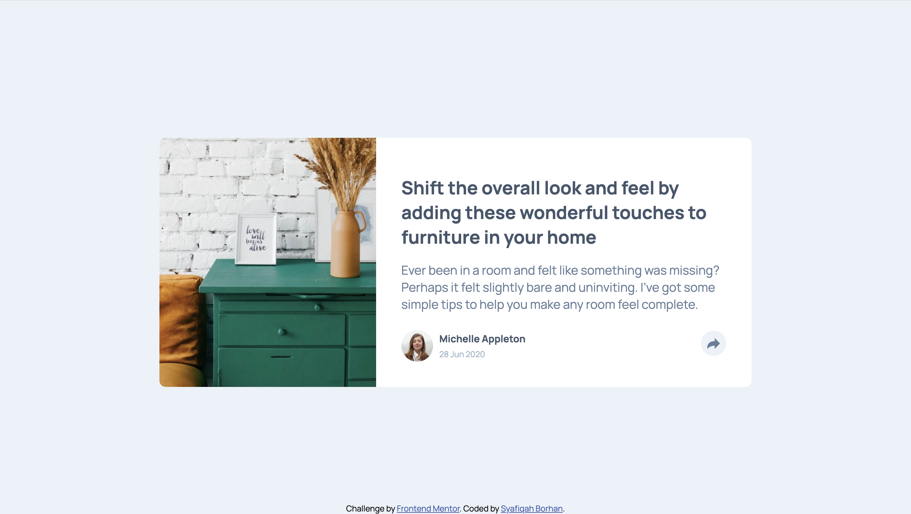

# article-preview-component

A project chllenge from frontend mentor. This time it is not just HTML and CSS but it will also use JavaScript. This is a good practice for people who left JavaScript for a while.

# Frontend Mentor - Article preview component solution

This is a solution to the [Article preview component challenge on Frontend Mentor](https://www.frontendmentor.io/challenges/article-preview-component-dYBN_pYFT). Frontend Mentor challenges help you improve your coding skills by building realistic projects.

## Table of contents

- [Overview](#overview)
  - [The challenge](#the-challenge)
  - [Screenshot](#screenshot)
  - [Links](#links)
- [My process](#my-process)
  - [Built with](#built-with)
  - [What I learned](#what-i-learned)
  - [Continued development](#continued-development)
  - [Useful resources](#useful-resources)
  - [AI Collaboration](#ai-collaboration)
- [Author](#author)
- [Acknowledgments](#acknowledgments)

**Note: Delete this note and update the table of contents based on what sections you keep.**

## Overview

### The challenge

Users should be able to:

- View the optimal layout for the component depending on their device's screen size
- See the social media share links when they click the share icon

### Screenshot



### Links

- Solution URL: [https://github.com/cosylily/article-preview-component.git]
- Live Site URL: [https://comforting-biscochitos-a88302.netlify.app/]

## My process

### Built with

- HTML
- CSS
- Javascript

### What I learned

In this particular project, I learned a lot of new stuff like cropping the image using css, use svg file and able to change its colour, position of css and used ::after for the first time. On top of that, a lot of revision is done for javascript as well. New learning on javascript is on the matching of screensize.

```html
<h1>Some HTML code I'm proud of</h1>
```

```css
.proud-of-this-css {
  color: papayawhip;
}
```

```js
const proudOfThisFunc = () => {
  console.log("🎉");
};
```

If you want more help with writing markdown, we'd recommend checking out [The Markdown Guide](https://www.markdownguide.org/) to learn more.

**Note: Delete this note and the content within this section and replace with your own learnings.**

### Continued development

Use this section to outline areas that you want to continue focusing on in future projects. These could be concepts you're still not completely comfortable with or techniques you found useful that you want to refine and perfect.

**Note: Delete this note and the content within this section and replace with your own plans for continued development.**

### Useful resources

- [https://uploadcare.com/blog/how-to-crop-an-image-in-html-and-css/]Never knew that you can always crop the image using CSS which makes everything much simpler.
- [https://stackoverflow.com/questions/43312042/svg-object-change-color-from-external-css] When SVG is presented as an image file, it might be confusing on how to change the colour of the icon. This is helpful to learn how to do it!
- [https://www.youtube.com/watch?v=YEmdHbQBCSQ] Coding2Go youtube video explaining positioning using CSS. Easy to understand. -[https://stackoverflow.com/questions/12483178/how-can-i-make-a-triangle-in-html] To make an triangle using borders. An interesting perspective

### AI Collaboration

Describe how you used AI tools (if any) during this project. This helps demonstrate your ability to work effectively with AI assistants.

- What tools did you use (e.g., ChatGPT, Claude, GitHub Copilot)?
- How did you use them (e.g., debugging, generating boilerplate, brainstorming solutions)?
- What worked well? What didn't?

**Note: Delete this note and the content above if you didn't use AI, or replace with your own experience.**

## Author

- Website - [Add your name here](https://www.your-site.com)
- Frontend Mentor - [@yourusername](https://www.frontendmentor.io/profile/yourusername)
- Twitter - [@yourusername](https://www.twitter.com/yourusername)

**Note: Delete this note and add/remove/edit lines above based on what links you'd like to share.**

## Acknowledgments

This is where you can give a hat tip to anyone who helped you out on this project. Perhaps you worked in a team or got some inspiration from someone else's solution. This is the perfect place to give them some credit.

**Note: Delete this note and edit this section's content as necessary. If you completed this challenge by yourself, feel free to delete this section entirely.**
